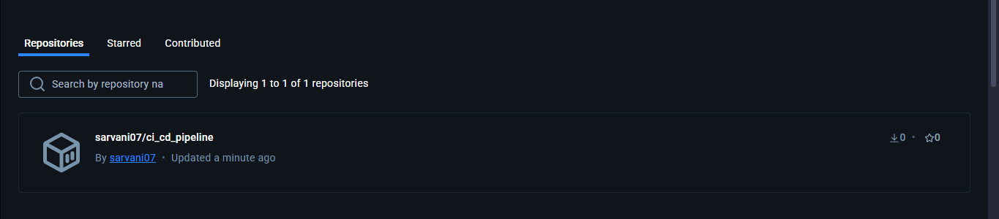

# Automated Docker Builds with GitHub Actions

This repository showcases a CI/CD pipeline using GitHub Actions to automate the testing, building, and pushing of a Docker image to Docker Hub.

## Table of Contents

- [Project Overview](#project-overview)
- [Repository Structure](#repository-structure)
- [CI/CD Workflow](#ci-cd-workflow)
- [Setup Instructions](#setup-instructions)
- [Screenshots](#screenshots)
- [Usage](#usage)

## Project Overview

This project demonstrates how to streamline Docker image management through automated processes. By leveraging GitHub Actions, we can ensure that every code change is thoroughly tested and that updated images are seamlessly pushed to Docker Hub.

## Repository Structure

- `app/`: Contains the application's source code.
- `tests/`: Includes unit tests for the application.
- `Dockerfile`: Defines the instructions for building the Docker image.
- `requirements.txt`: Lists the Python dependencies.
- `.github/workflows/docker-build.yml`: Defines the GitHub Actions workflow.
- `README.md`: This documentation file.

## CI/CD Workflow

The GitHub Actions workflow defined in `.github/workflows/docker-build.yml` performs the following steps:

1. **Automated Testing:**
   - Runs unit tests whenever code is pushed to the `main` branch or a pull request is created.
2. **Docker Image Build and Push:**
   - If the tests pass and the event is a push to the `main` branch (not a pull request), the workflow:
     - Builds the Docker image.
     - Pushes the image to Docker Hub.

## Setup Instructions

1. **Create a GitHub Repository:**
   - Create a new GitHub repository.
2. **Add Project Files:**
   - Add the files from this project to your repository.
3. **Configure GitHub Secrets:**
   - In your GitHub repository settings, add the following secrets:
     - `DOCKERHUB_USERNAME`: Your Docker Hub username.
     - `DOCKERHUB_TOKEN`: A Docker Hub access token (create one in your Docker Hub account settings).

## Screenshots

### Docker Hub Repository

- Screenshot showing the Docker image being pushed to Docker Hub:

  

## Usage

1. **Push Code Changes:**
   - Make changes to the application code and push them to the `main` branch.
2. **Observe GitHub Actions:**
   - Go to the "Actions" tab in your GitHub repository to monitor the workflow's progress.
3. **Verify Docker Hub:**
   - Check your Docker Hub repository to confirm that the updated image has been pushed.
